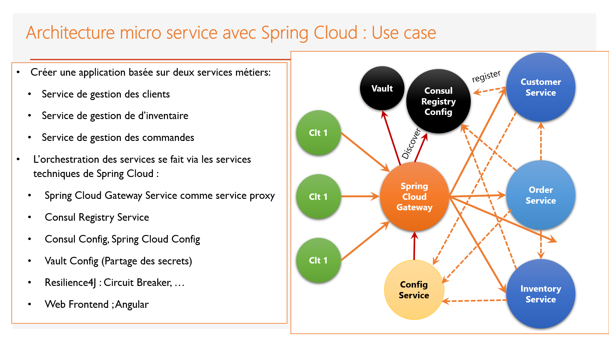
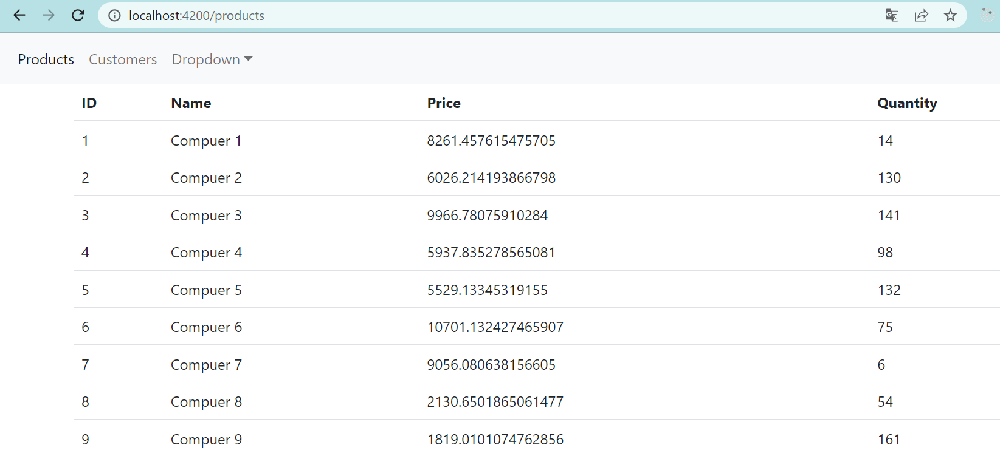
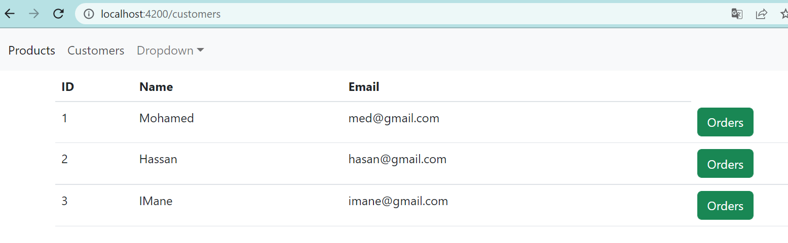
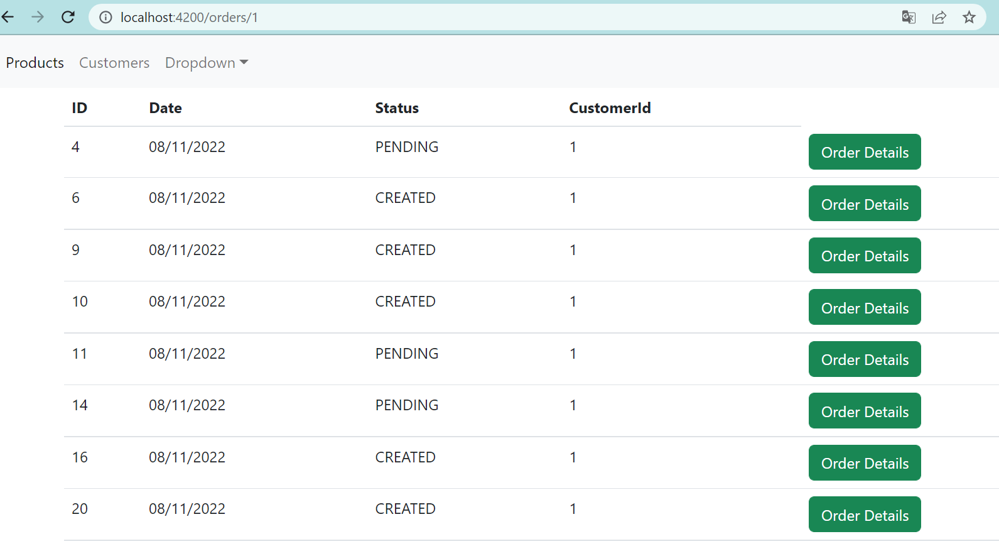
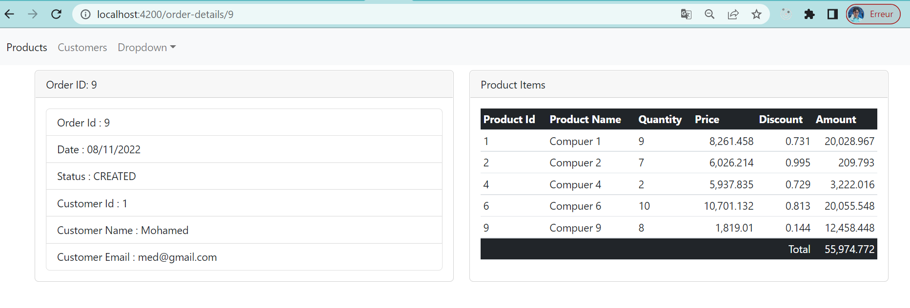

<h3>Commande pour lancer Consul</h3>
<strong>> consul agent -server -bootstrap-expect=1 -data-dir=consul-data -ui -bind=192.168.43.32</strong>
<h3>Commande pour lancer Vault</h3>
<strong>> vault server -dev</strong>
<h3>Captures</h3>
</img>
</img>
</img>
</img>
</img>
